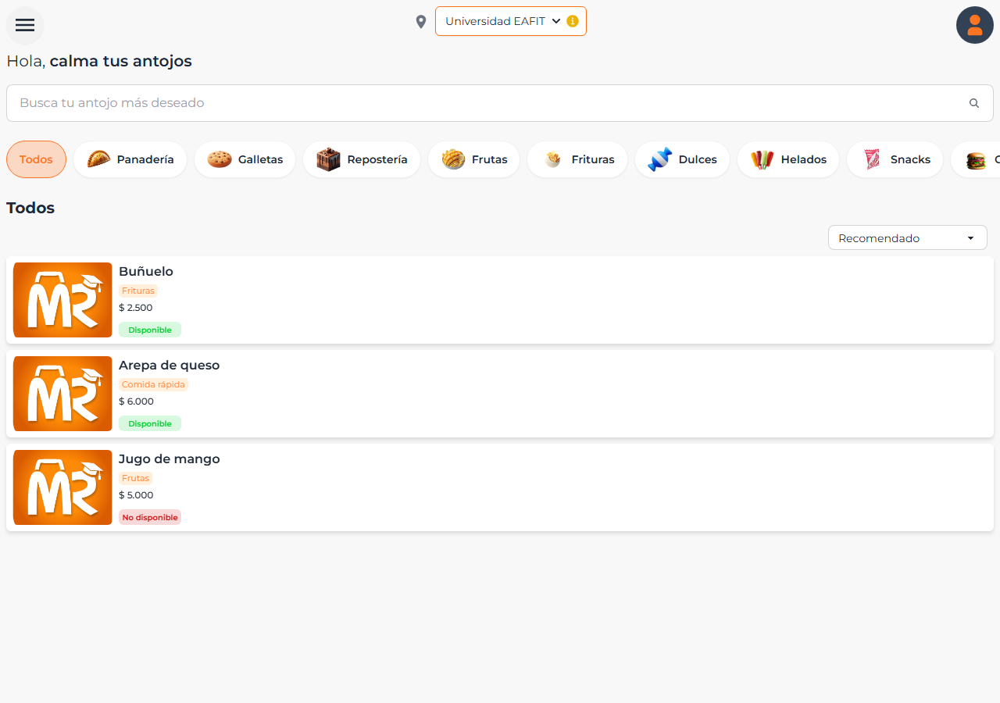
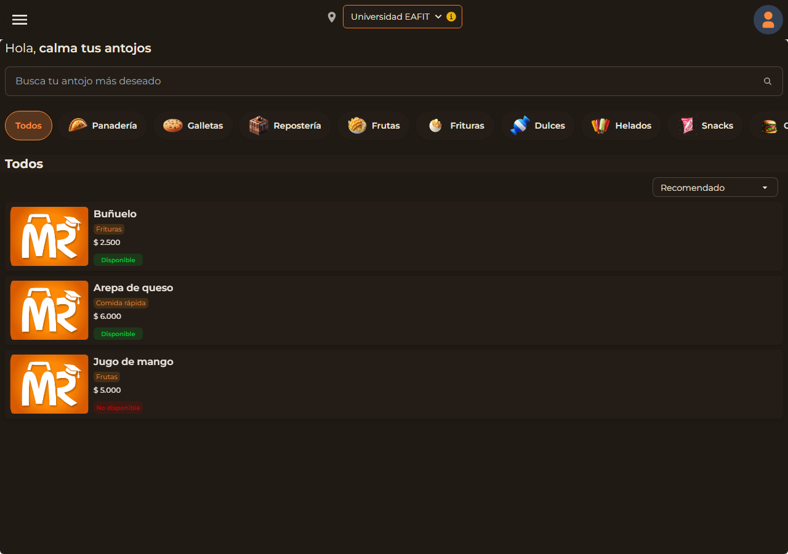
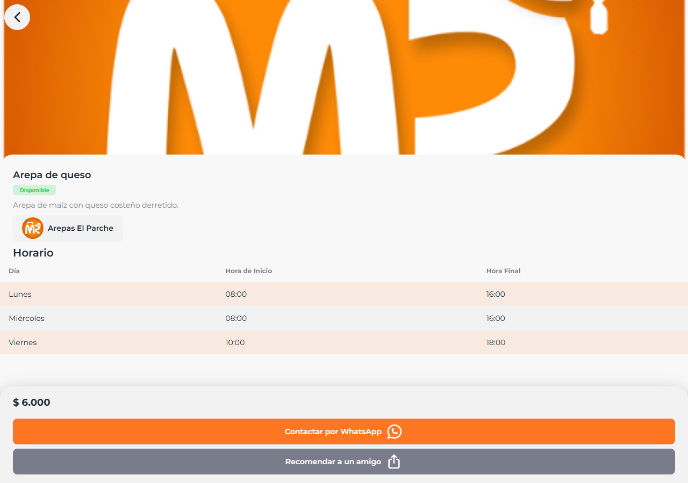
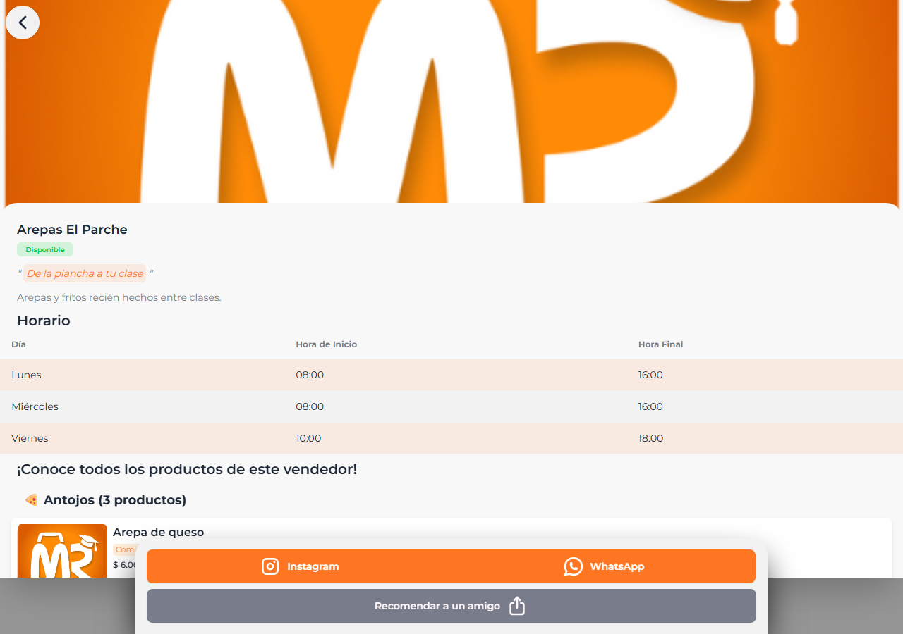

# Mercampus

A marketplace where university students in Colombia buy and sell food from
each other — and, in a second, smaller section, non-food items (accessories,
makeup, clothes). Browsing is scoped to a university (a selector at the top
of the page, e.g. "Universidad EAFIT"): sign up, list what you're selling,
and buyers reach you over WhatsApp to close the deal.

Live at [mercampus.vercel.app](https://mercampus.vercel.app).

## Screenshots

The product listing (`/antojos`), light and dark:

<p>
  
  
</p>

Product detail and seller profile:

<p>
  
  
</p>

These are real renders taken for [T-67](docs/audits/t-67/README.md), not
mockups — see that folder for the full audit and more screens (seller
onboarding, product management, the availability badges from
[T-122](docs/audits/t-122/)/[T-123](docs/audits/t-123/)). One thing to know
looking at them: the seed data used to take them points at placeholder image
URLs, so product photos render as the Mercampus logo instead of real food —
that's a fixture limitation, not a bug in the app.

## What's implemented

- A product catalog split into two sections — `antojos` (food) and
  `marketplace` (everything else) — with categories, search, and an
  availability badge computed from each seller's weekly schedule.
- Seller accounts: registration, an admin approval step before a seller can
  list products, product management (add/edit), and weekly opening-hours
  schedules.
- Buyer contact is a WhatsApp deep link per product — there's no in-app cart
  or checkout yet (see `Order` in `src/utils/models/orderSchema.ts` for a
  data model that exists ahead of the UI that would use it).
- A PQRS form (`/antojos/pqrs`) for complaints/suggestions, and an admin
  section (`/admin/sellers`) to approve or reject pending sellers.
- Spanish is the default UI language; a partial English translation exists
  via `next-intl` (currently the `/about` page and the locale switcher).

## Stack

- **[Next.js 14](https://nextjs.org)**, App Router — `src/app/`.
- **MongoDB** via **Mongoose** — schemas in `src/utils/models/` (moving
  toward `src/models/`, see "Project structure" below).
- **[Clerk](https://clerk.com)** for authentication, including its Next.js
  middleware (`src/middleware.js`) gating signed-in routes.
- **[ImageKit](https://imagekit.io)** for product image storage and
  delivery (`src/utils/imagekit.js`, `src/app/api/images/`). A Cloudinary
  dependency also exists in `package.json` but nothing under `src/` calls
  it — the project hasn't yet settled on dropping it (tracked as T-35/T-109
  in `ROADMAP.md`).
- **Tailwind CSS + daisyUI** for styling and theming (light/dark).
- **Zod** for request validation at API boundaries.
- **[Vercel](https://vercel.com)** for hosting (`vercel.json`). Seller
  availability is refreshed by hitting a deployed API route every 10
  minutes from a GitHub Actions workflow
  (`.github/workflows/availability-cron.yml`) — `vercel.json`'s own cron
  entry calls the same route too, but only once a day, since Vercel's free
  tier caps native crons at that frequency.
- **Vitest** for unit/integration tests, **Playwright** for e2e.

## Environment variables

Copy `.env.example` to `.env` and fill in the values — it's the source of
truth for every variable this app reads, with comments on where each one
comes from and any gotcha attached to it (e.g. ImageKit's private key must
never carry the `NEXT_PUBLIC_` prefix). This README won't repeat actual
values; none of them belong in a public document, and `.env` is gitignored.

At minimum, local development needs a MongoDB connection string and a Clerk
key pair; uploading images needs ImageKit's keys too.

## Running it locally

```bash
npm ci
cp .env.example .env   # then fill in the values
npm run dev
```

Seed some test data (idempotent — safe to run more than once):

```bash
npm run seed
```

`npm run seed` refuses to run against anything that isn't `localhost` unless
you pass `--yes` — that guard exists on purpose, to keep a misconfigured
`MONGO_URI` from wiping a shared database. Don't remove it.

## Running the tests

```bash
npm run verify    # lint + typecheck + test + build — the CI gate (`quality`)
npm run test      # Vitest unit/integration tests only
npm run test:e2e  # Playwright, orchestrated by scripts/e2e.mjs
```

`npm run test:e2e` needs more than `.env`: Clerk's middleware performs a
handshake against Clerk's own servers on every request, so a fake or missing
publishable key makes it answer 400 on every route, including public ones.
You need a real Clerk **development**-instance key pair —
`NEXT_PUBLIC_CLERK_PUBLISHABLE_KEY` and `CLERK_SECRET_KEY` — the latter used
to create and delete a throwaway account for the signed-in specs. `.env` in
local dev already carries both; CI only runs the e2e/lighthouse jobs when a
repo variable (`E2E_ENABLED`) and the corresponding secrets are set (see
`.github/workflows/ci.yml`), since a fork's PR never receives repo secrets.

## The agentic pipeline

Most of the day-to-day work on this repo — bug fixes, small features, audits,
this README — is written by an AI agent working from `ROADMAP.md`, which is
the actual task backlog and contract (each entry states what "done" means).
A short version of how a change gets to production:

1. An agent takes one unchecked `ROADMAP.md` task, branches
   `agent/<task-id>` off `agent/develop`, and opens a PR back into
   `agent/develop`.
2. GitHub Actions runs the `quality` check (`npm run verify`) on that PR.
   The agent merges its own PR, but only once `quality` is green — never on
   red or pending.
3. A scheduled ("nightly") run of the same agent picks up tasks marked
   `Nightly: yes` in `ROADMAP.md` — one task per run, and it never merges
   into `develop` or `main` itself.
4. Promoting `agent/develop → develop → main` (production) is a manual step
   a human reviews and merges.

The rules an agent works under live in `CLAUDE.md` — things like "one
ROADMAP task per PR," "no change without a way to verify it," and "never
push to `main` or `develop` directly."

## Project structure

```
src/
  app/            routes (pages + surviving API routes)
  components/     UI, no data access
  server/         data access and business logic (server-only) — target
  lib/            pure utilities, Zod validators, logger — target
  utils/, services/  the pre-refactor equivalents of server/ and lib/,
                  still in use in parts of the app
  models/         Mongoose schemas — target (currently src/utils/models/)
scripts/          one-off scripts and migrations
tests/            unit/integration (Vitest) and e2e (Playwright)
```

`server/`, `lib/`, and `models/` are where new code goes; `utils/` and
`services/` are being phased out but still hold real, in-use code — see
`CLAUDE.md` before assuming anything under them is dead.

## License

MIT — see [LICENSE](LICENSE).
